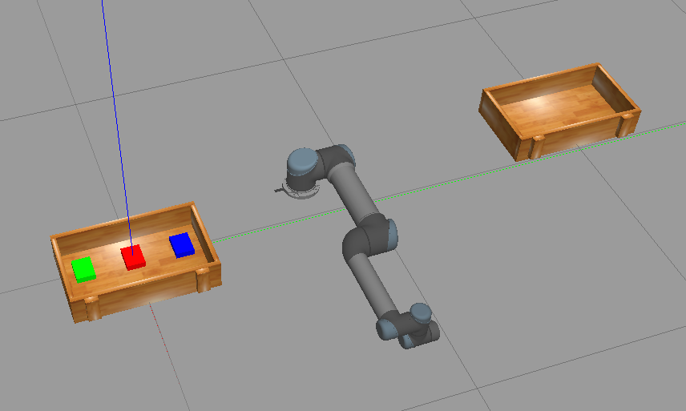

# MTRN4230 Group 14 Project
# UR5-ROS-Gazebo 

## Current Status
* Preliminary basic environment 1 input container, 1 output container and 3 objects

## ToDo:
* Convert python script into proper ROS receiver node (don't need to modify current script)
* Camera
* UR5 Kinematics

## Installation and Running
1. `mkdir group_project & cd group_project`
2. `git clone https://github.com/quitefrankli/MTRN4230_Group_14`
3. `catkin_make`
4. `source devel/setup.bash`
5. `roslaunch ur5_t2_4230 ur5_world.launch`
