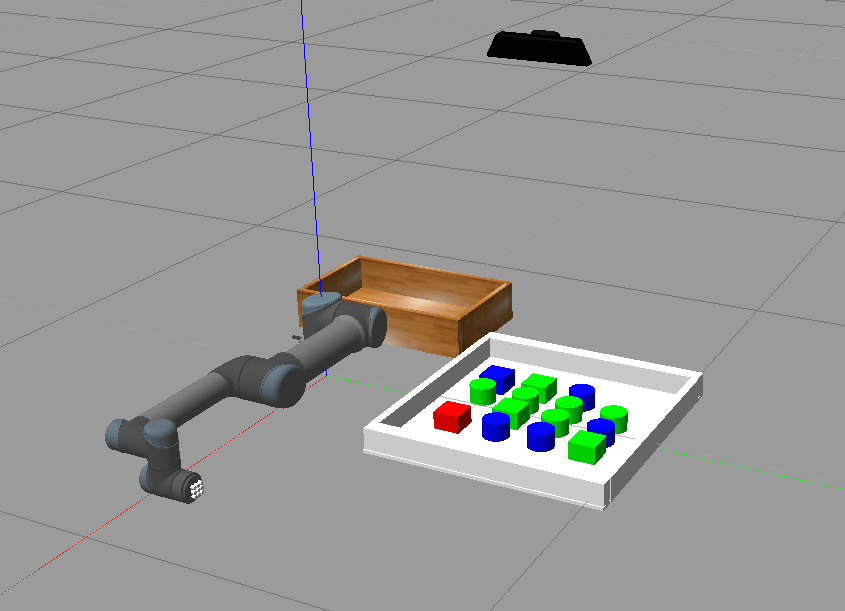
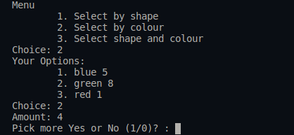
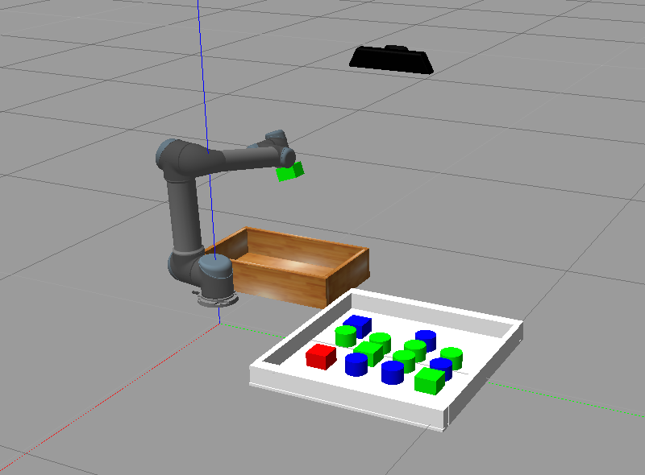

# MTRN4230 Group 14 Project

Tested on Ubuntu 16.04 ROS Kinetic

## Required Additional Library
* `pip install opencv-python`

## Environment
* Preliminary basic environment 1 input container, 1 output container and 14 objects\

* Interface snapshot\

* Pick and place\

## Installation and Running
1. `git clone https://github.com/quitefrankli/MTRN4230_Group_14`
2. `cd MTRN4230_Group_14`
3. `catkin_make`
4. `source devel/setup.bash`
5. `roslaunch ur5_t2_4230 ur5_world.launch` This will launch Gazebo and spawn objects
6. `roslaunch ur5_t2_4230 actions.launch` This will launch interface

## Acknowledgements
[lihuang3/ur5_ROS-Gazebo](https://github.com/lihuang3/ur5_ROS-Gazebo)